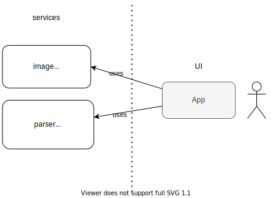

# Cast Labs Challange
Micro ISOBMFF parser app

## Start app (on localhost)
```
yarn && yarn start
```

## Architecture


## Limitations

1. This parser can handle depth of nesting of ISOBMFF boxes max cca 1000 boxes deep.

