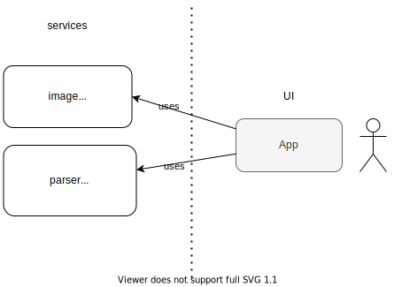
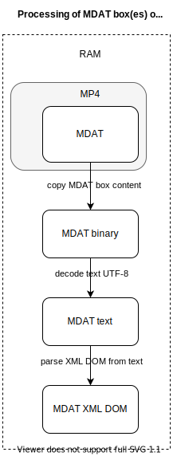

# Cast Labs Challenge
Micro ISOBMFF parser app

## Start the app
```bash
# start the app on localhost
yarn && yarn start
```

## Compatibility
Tested in Chrome version 108.0.5359.71 (MacOS) and Edge version 108.0.1462.42 (Windows)

## Architecture


## Limitations

1. Nesting of boxes in the ISOBMFF media file can be max 1000 levels deep.

## Notes about large MDAT box

If the contents of MDAT box(es) is very large, the app will consume a lot of RAM and it may even run out of memory, depending on how much RAM is available.

While processing an MDAT box, the app consumes approx. 4x the RAM taken up by the MDAT box content, because it makes 4 copies  (one binary copy, one text and one parsed XML DOM tree). Until the copies are garbage collected, we can expect a spike in RAM 4x the size of the MDAT box data.



It would be possible to optimize RAM usage by reading the MP4 file as a stream, processing it chunk by chunk and printing output to console chunk by chunk as well.

If images contained in the XML file are relatively small compared to the overall size of the XML file, their extraction could also be optimized by using a SAX parer that parses XML sequentially instead of parsing the whole DOM tree.


## Notes
Sometimes when I stitch videos, progress bar shows buffered only the first video and only it plus a bit of the second plays, then the player stops at buffering and never continues. In the console there are no errors. This seems to be a bug of MSE!


